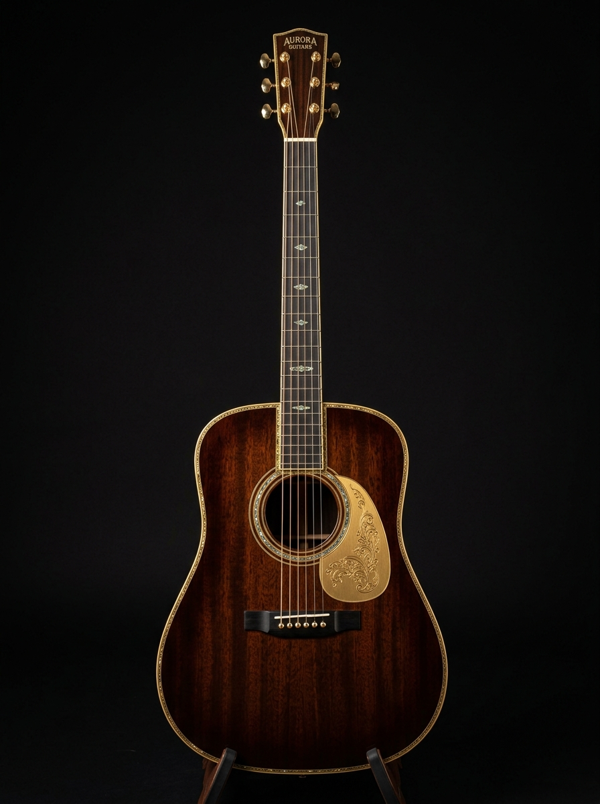

# STRATOS 🎯


## Basic Details
### Team Name: Iyaaaa


### Team Members
- Team Lead: Diya Anish - SNGCE
- Member 2: Riya Anna KF - SNGCE

### Project Description
STRATOS is a fake, futuristic acoustic-analysis system where users “perform” on a virtual guitar while the system monitors their performance.
As the strings progressively break, the professional interface descends into chaos, ending with a ridiculous cinematic reveal.


### The Problem (that doesn't exist)
Guitars keep losing their strings, and nobody knows why.
STRATOS solves this critical global crisis by using advanced acoustic intelligence to monitor guitar performance and scientifically analyze the inevitable destruction of every string. 

### The Solution (that nobody asked for)
STRATOS uses cutting-edge acoustic intelligence to monitor your guitar, analyze its performance, and detect string failure in real time.
Our revolutionary solution? Let the user break every string themselves and then generate an extremely serious report about it. :)

## Technical Details
### Technologies/Components Used
For Software:

Languages used: HTML, CSS, JavaScript
Frameworks used: None
Libraries used: None
Tools used: VS Code / Antigravity IDE, Git, GitHub
Other components: SVG, HTML5 Audio, CSS animations & transitions, GitHub Pages for deployment

For Hardware:
- N/A (Pure Software Application)

### Implementation
For Software:
Developed a static web application using HTML, CSS, and Vanilla JavaScript.
Created an interactive virtual guitar where users can click and play individual strings.
Implemented string-breaking logic with audio effects and visual state changes.
Added dynamic acoustic telemetry, waveform visualizations, system warnings, and glitch effects as strings are lost.
Implemented a cinematic final reveal with the final image and dialogue audio after all strings are broken.
Used CSS animations and JavaScript DOM manipulation to create the interactive experience.
Deployed the project using GitHub Pages.

# Installation
```bash
git clone https://github.com/riyaannakf/useless_project_temp.git
cd useless_project_temp/stratos
```
git clone <repository-url>
cd STRATOS

# Run
Open `index.html` directly in your browser or run a local static server (e.g. VS Code Live Server).

### Project Documentation
For Software:

# Screenshots

*STRATOS Dashboard showing acoustic resonance spectrum, telemetry, and interactive guitar workstation*


*Interactive guitar string matrix with real-time waveform oscilloscope and telemetry readouts*


*Dynamic system status updates degrading from Optimal to Panic Mode as strings snap*

# Diagrams
```
┌─────────────────────┐
│   STRATOS Landing   │
│       Page          │
└──────────┬──────────┘
           ↓
┌─────────────────────┐
│ Initialize Acoustic │
│      System         │
└──────────┬──────────┘
           ↓
┌─────────────────────┐
│   Play Guitar       │
│   Strings           │
└──────────┬──────────┘
           ↓
┌─────────────────────┐
│ String Breaks +     │
│ Audio/Visual Update │
└──────────┬──────────┘
           ↓
┌─────────────────────┐
│ System Degradation  │
│ & Panic Mode        │
└──────────┬──────────┘
           ↓
┌─────────────────────┐
│   Final String      │
│      Breaks         │
└──────────┬──────────┘
           ↓
┌─────────────────────┐
│ Cinematic Uncle     │
│ Reveal + Audio      │
└─────────────────────┘
```
*System Workflow & Degradation State Machine*

For Hardware:

# Schematic & Circuit
*N/A (Software Project)*

# Build Photos
*N/A (Software Project)*

### Project Demo
# Video
[Add your demo video link here]
*Demonstration of STRATOS acoustic visualizers and interactive string snap progression*

# Additional Demos
[Add any extra demo materials/links]

## Team Contributions
- Diya Anish: Project architecture, HTML/CSS design, and UI styling
- Riya Anna KF: Web Audio API synthesis engine, canvas visualizer logic, and system state machine

---
Made with ❤️ at TinkerHub Useless Projects 


